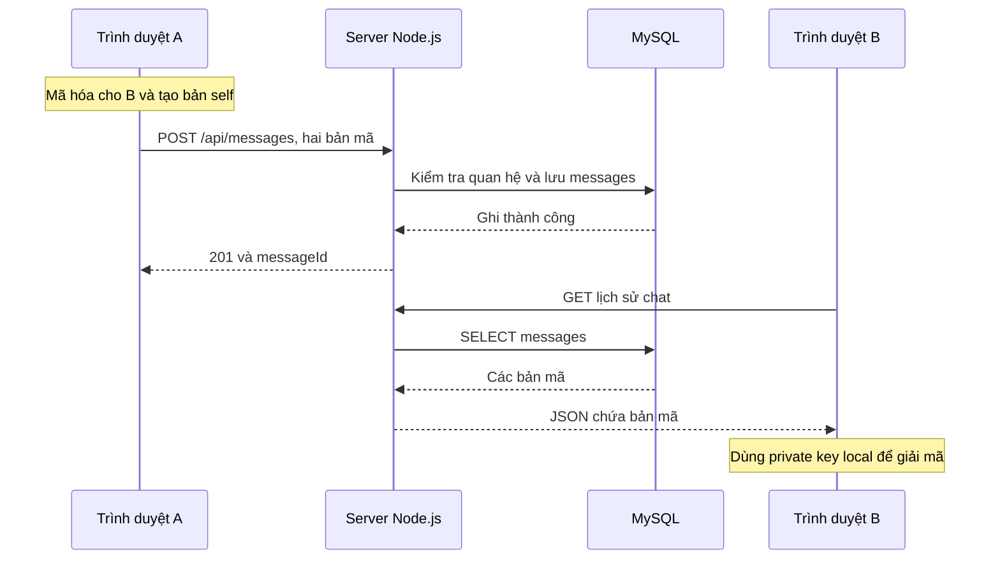

# Seruchat: chức năng từng file và luồng hoạt động

Ứng dụng gồm trình duyệt, server Node.js và MySQL. Sender/Receiver Java là các client khác có thể kết nối cùng server. Server phục vụ client ở http://localhost:3000; không cần chạy một server riêng trong thư mục client.

## 1. Các nhóm file

| File / nhóm | Chức năng |
|---|---|
| client/index.html | Các form đăng nhập, đăng ký, tìm user, danh sách bạn/lời mời/chặn, vùng chat và hộp Yes / No |
| client/css/style.css | Bố cục, nút thao tác, trạng thái, bong bóng tin và hộp xác nhận |
| client/js/app.js | Nhận thao tác người dùng, hỏi xác nhận, gọi API, cập nhật danh sách và hiển thị tin đã giải mã |
| client/js/encryption/keyManager.js | Tạo/lưu cặp khóa X25519 trong IndexedDB; mã hóa/giải mã backup private key bằng mật khẩu |
| client/js/encryption/encryption.js | Tạo bản mã cho người nhận và một bản riêng cho người gửi; gửi hai bản mã lên API |
| client/js/encryption/decryption.js | Giải mã tin nhận hoặc bản self của tin tự gửi |
| client/js/keyIntegration.js | Nối các hàm khóa có sẵn với API; dùng lại khóa local, khôi phục backup, tránh vô tình thay khóa |
| server/src/server.js | Khởi tạo Express, session, các route, phục vụ giao diện, bật cổng và đóng kết nối khi dừng |
| server/src/config/database.js | Đọc server/.env và tạo pool kết nối MySQL |
| authController.js | Kiểm tra đăng ký, băm mật khẩu bằng Argon2, kiểm tra đăng nhập và tạo session |
| userController.js | Tìm user theo UUID, trả thông tin user và trạng thái quan hệ với người đang đăng nhập |
| friendshipController.js | Gửi/nhận/hủy/accept/reject lời mời; danh sách bạn; xóa bạn; chặn và bỏ chặn |
| conversationController.js | Tạo hoặc dùng lại chat giữa hai người đã là bạn; trả danh sách chat và trạng thái quan hệ |
| keyController.js | Lưu/lấy public key, lưu backup private key đã mã hóa; backup chỉ chủ tài khoản được đọc |
| messageController.js | Kiểm tra người gửi, thành viên chat, trạng thái bạn bè và định dạng bản mã; lưu/trả lịch sử tin |
| middleware/auth.js | Chặn API cần đăng nhập khi session chưa hợp lệ |
| middleware/rateLimit.js | Giới hạn số request theo tài khoản/IP, chống gửi liên tục |
| middleware/debugRequests.js | Log tên thao tác, route, status, thời gian; không đọc body/cookie/query string |
| utils/api.js | Kiểm tra UUID, Base64, public key; chuẩn hóa lỗi API |
| utils/transactions.js | Transaction và khóa quan hệ khi thao tác đồng thời, tránh ghi trạng thái mâu thuẫn |
| server/tools/watchDatabase.js | Chỉ đọc database mỗi 3 giây; hiện số dòng và preview bản mã tin gần nhất |
| database/schema.sql | Schema đầy đủ cho database seruchat trên máy mới |
| database/seruchat_full.sql | Schema tương đương, dùng tên seruchat_full theo cấu hình trên máy bạn |
| database/upgrade-friends.sql | Nâng database cũ lên khả năng ghi trạng thái trước khi chặn; không tạo lại/xóa bảng |
| encryption/ApiClient.java | HTTP, đăng nhập/session, JSON và lưu khóa local cho chương trình Java |
| encryption/Sender.java | Tạo bản mã và gửi qua HTTP |
| encryption/Receiver.java | Nhận bản mã, dùng khóa riêng local để giải mã và nhớ ID tin đã nhận |

## 2. Database lưu những gì?

| Bảng | Nội dung |
|---|---|
| users | UUID, username, email, password_hash và thời điểm tạo |
| public_keys | Public key X25519; backup private key đã mã hóa, salt và IV cho account web |
| friendships | Cặp user, ai gửi lời mời, pending/accepted/rejected/blocked, ai chặn và trạng thái trước khi chặn |
| conversations | ID và thời điểm tạo chat |
| conversation_members | Hai user thuộc chat; dùng kiểm tra quyền đọc/gửi |
| messages | ID tin/chat/người gửi; ciphertext, IV, public key tạm thời; các trường self tương ứng |
| sessions | Phiên đăng nhập server, thời hạn và userId trong session |

Một user tham gia nhiều chat; một chat có nhiều messages. Một cặp user có tối đa một dòng friendships nhờ khóa UNIQUE theo cặp UUID đã sắp thứ tự.

## 3. Đăng ký và đăng nhập

Đăng ký: điền form > Yes > POST /api/auth/register > server kiểm tra email trùng/định dạng > Argon2 băm mật khẩu > INSERT users > trả ID. Đăng ký chưa tự đăng nhập.

Đăng nhập: điền email/mật khẩu > Yes > POST /api/auth/login > server đọc users và dùng Argon2 verify > tạo lại session ID > lưu session vào MySQL > trả cookie và thông tin user. Các request sau gửi cookie để server nhận ra tài khoản; userId của người gửi được lấy từ session, không tin một senderId do client tự khai.

Mật khẩu được gửi đến server để xác thực đăng nhập; server lưu password_hash. E2EE ở đây bảo vệ nội dung chat, không có nghĩa rằng thao tác đăng nhập không gửi mật khẩu. Dùng HTTPS khi triển khai ngoài localhost.

Sau đăng nhập, trình duyệt chuẩn bị khóa. Nếu IndexedDB đã có khóa thì dùng lại. Nếu là thiết bị mới và có backup, mật khẩu đăng nhập được dùng để mở backup; nếu đây là tài khoản web mới chưa có key thì tạo bộ khóa. Private key nằm ở client; bản backup gửi lên server đã mã hóa bằng khóa dẫn xuất PBKDF2 từ mật khẩu. Adapter không tự thay public key khác để tránh làm mất khả năng đọc lịch sử.

## 4. Kết bạn, chặn và xóa bạn

Tìm User ID > GET /api/users/:id > hiển thị user và trạng thái quan hệ. Các nút được chọn theo trạng thái, tránh gửi lại một lời mời đang pending hoặc hiện nút bỏ chặn cho người không có quyền.

Gửi lời mời > Yes > POST /api/friendships/request > kiểm tra user tồn tại, không phải chính mình, không bị chặn/đã là bạn/đang pending > tạo hoặc đổi rejected sang pending. Người nhận thấy trong Lời mời nhận được, người gửi thấy trong Lời mời đã gửi.

Chấp nhận > Yes > chỉ người nhận được đổi pending sang accepted. Từ chối đổi sang rejected. Hủy lời mời chỉ dành cho người gửi và chỉ khi pending. Chỉ accepted mới mở/tạo chat để gửi tin mới.

Chặn > Yes > server ghi blocked_previous_status trước khi đổi status sang blocked, ghi blocked_by/blocked_at. Hai bên không gửi tin mới hoặc gửi lời mời; thành viên chat vẫn đọc được lịch sử.

Bỏ chặn > Yes > server xác minh session là blocked_by. Nếu trạng thái cũ là accepted thì khôi phục accepted và xóa các dấu chặn. Nếu chưa là bạn thì bỏ dòng chặn, cho phép lời mời mới; không tự cấp quyền gửi tin.

Xóa bạn > Yes > xóa dòng accepted trong friendships, giữ conversation/members/messages. Gửi tin mới bị từ chối cho đến khi kết bạn lại. Khi accepted lại, Open Chat dùng lại conversation cũ nên lịch sử không bị chia sang một chat khác.

Hộp No/Esc hủy thao tác chủ động trước khi gửi request thay đổi tương ứng. Server vẫn kiểm tra quyền nếu một client khác gọi API trực tiếp.

## 5. Mở chat

Danh sách bạn > Mở chat > Yes > POST /api/conversations với friendId. Server kiểm tra accepted, khóa quan hệ và tìm chat đã có. Có chat thì trả lại ID; chưa có thì tạo conversations và hai conversation_members trong một transaction. UI chỉ bật ô nhập sau khi mở chat xong và khóa đã sẵn sàng.

Mở chat trong danh sách Cuộc trò chuyện là đọc lịch sử: không cần accepted để đọc các bản mã cũ, nhưng ô gửi bị khóa nếu quan hệ hiện tại chưa accepted/đang blocked.

## 6. Gửi và nhận tin nhắn

Ví dụ A gửi “Xin chào B”. A nhập tin > Yes. Trình duyệt lấy public key lâu dài của B. Hàm encryption.js tạo cặp X25519 tạm thời cho tin này, kết hợp private key tạm thời với public key B để tạo shared secret, dùng HKDF-SHA256 với info e2ee-chat-v1 để dẫn xuất AES-256 key, tạo IV 12 byte rồi mã hóa AES-GCM với tag 128 bit.

Nó đồng thời tạo một bản self mã hóa cho public key của A. Vì thế tin có ciphertext/nonce/sender_public_key cho B và self_ciphertext/self_nonce/self_public_key cho A. Base64 là cách chuyển byte sang chuỗi JSON/SQL; Base64 không phải thuật toán mã hóa.

POST /api/messages gửi hai bản mã đến server. Server kiểm tra session, thành viên chat, accepted, định dạng IV/public key và giới hạn gửi, rồi INSERT messages. Server không cần private key hay AES key để lưu/chuyển bản mã.

B đang mở tab thì khoảng 2,5 giây sẽ GET /api/messages/:conversationId. Server kiểm tra B là thành viên, SELECT lịch sử và trả bản mã. decryption.js dùng private key lâu dài của B cùng public key tạm thời kèm tin, dẫn xuất cùng AES key và giải mã. Tin bị thay đổi hoặc khóa không đúng sẽ thất bại xác thực/giải mã. A đọc bản self của tin do chính mình gửi.

Server thấy được metadata như ai gửi, chat nào, thời điểm và độ dài bản mã. Các hàm crypto trong bản gốc được giữ nguyên; bản cập nhật không thêm ratchet hoặc cơ chế kiểm chứng public key ngoài server.

## 7. Reload, khóa và các loại mật khẩu

Reload: /api/auth/me kiểm tra session; IndexedDB cung cấp khóa cũ; lấy danh sách và giải mã lịch sử. Trình duyệt mới cần mật khẩu và backup. Account Java giữ private key trong encryption/keys; không có luồng tự mở backup web trên Receiver Java.

Ba giá trị khác nhau: DB_PASSWORD là mật khẩu MySQL để Node kết nối DB; password của account web để xác thực và mở backup key; SESSION_SECRET ký cookie/session, không phải khóa AES của tin nhắn. Đổi SESSION_SECRET có thể làm cookie cũ mất hiệu lực.

## 8. Quan sát lúc chạy

CMD 1: set DEBUG_API=1 rồi npm start, xem LOGIN/FRIEND_REQUEST/SEND_MESSAGE/UNBLOCK_USER cùng HTTP status. CMD 2: node tools/watchDatabase.js, xem số bản ghi và ciphertext preview. Workbench: SELECT các bảng để xem bản ghi cụ thể; F12 > Network trong trình duyệt xem request/response. MySQL là dịch vụ DB riêng; hai CMD trên là API server và một chương trình chỉ đọc DB.

Đọc docs/terminal-debug.md để có lệnh chi tiết. Đọc docs/upgrade-local.md để cập nhật máy đang dùng mà giữ dữ liệu.
